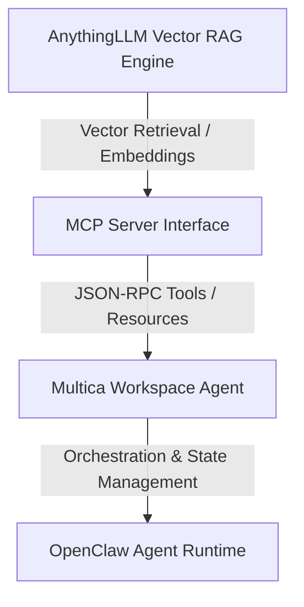

# AnythingLLM RAG MCP Architecture & Integration Guide

This document details the architectural integration of **AnythingLLM** vector database retrieval capabilities within the **Multica Agent** ecosystem via a custom **Model Context Protocol (MCP)** server running on top of the **OpenClaw Runtime**.

---

## 🏗 1. System Architecture Diagram



### Exact Component Layer Hierarchy

```
AnythingLLM
      |
      |
 MCP Server
      |
      |
 Multica Agent
      |
      |
 OpenClaw Runtime
```

---

## 🔍 2. Architectural Layer Breakdown

### 1. AnythingLLM RAG Core Layer
- **Function**: Manages document chunking, vector embedding generation (LanceDB / Milvus / Pinecone backends), and semantic similarity search across ingested PDFs, Markdown notes, and API documentation.
- **API Access**: Exposes REST endpoints (`/api/v1/workspace/{slug}/similarity-search`).

### 2. MCP Server Bridge Layer (`anythingllm-mcp-server`)
- **Function**: Wraps AnythingLLM REST endpoints into standardized MCP tools (`query_documents`, `list_workspaces`, `fetch_document_snippet`).
- **Transport**: Communicates over STDIO / Streamable HTTP using JSON-RPC 2.0 protocol format.

### 3. Multica Agent Layer
- **Function**: Invokes `query_documents` tool dynamically whenever user prompts require external codebase or document context before formulating answers.

### 4. OpenClaw Runtime Layer
- **Function**: Handles agent process execution, environment secret bindings, retry policies, and session state persistence.

---

## ⚙ 3. MCP Server Configuration (`anythingllm_mcp.json`)

```json
{
  "mcpServers": {
    "anythingllm-rag": {
      "command": "node",
      "args": [
        "./dist/index.js"
      ],
      "env": {
        "ANYTHINGLLM_BASE_URL": "http://localhost:3001/api/v1",
        "ANYTHINGLLM_API_KEY": "892A74B-9182374-ANYTHINGLLM_KEY",
        "DEFAULT_WORKSPACE": "multica-knowledge-base"
      }
    }
  }
}
```

---

## 💻 4. MCP Tool Specification & Sample Query

### Tool Definition (`query_documents`)
```json
{
  "name": "query_documents",
  "description": "Performs semantic vector search across AnythingLLM knowledge base and returns top matching text chunks.",
  "inputSchema": {
    "type": "object",
    "properties": {
      "query": {
        "type": "string",
        "description": "Search query or natural language concept"
      },
      "topK": {
        "type": "number",
        "default": 4
      }
    },
    "required": ["query"]
  }
}
```

### Sample Output Returned to Agent Context
```json
{
  "results": [
    {
      "chunkId": "doc_8492_chunk_12",
      "source": "OpenClaw_Multi_Agent_Team.md",
      "similarityScore": 0.92,
      "text": "OpenClaw agents communicate via JSON-RPC over the internal claw-bus event queue..."
    }
  ]
}
```
