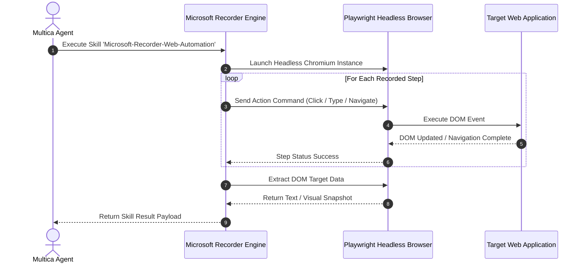

# Microsoft Recorder Skill for Automated Visual DOM Actions

This document covers the integration of the **Microsoft Recorder Skill** within the Multica framework, enabling agents to record, parse, and execute automated browser GUI workflows through visual DOM selector replay.

---

## 📽 1. Overview & Capabilities

The **Microsoft Recorder Skill** bridges the gap between manual user actions on web applications and autonomous browser automation:
- **Visual Capture**: Records user interactions (clicks, text input, form navigation, drop-down selections).
- **DOM Selector Extraction**: Automatically extracts robust CSS selectors, XPath expressions, and ARIA labels.
- **Agent Skill Replay**: Translates recorded step logs into repeatable JSON skill manifests executable by Playwright / Puppeteer agent runtimes.

---

## 🛠 2. Skill Definition (`recorder_skill.json`)

```json
{
  "skillName": "Microsoft-Recorder-Web-Automation",
  "version": "1.0.0",
  "description": "Visual DOM interaction recording and replay skill for web agent navigation",
  "driver": "playwright-chromium",
  "recordedSteps": [
    {
      "stepIndex": 1,
      "action": "navigate",
      "url": "http://localhost:3000/login"
    },
    {
      "stepIndex": 2,
      "action": "type",
      "selector": "input[name='username']",
      "value": "${ENV_AGENT_USER}"
    },
    {
      "stepIndex": 3,
      "action": "type",
      "selector": "input[name='password']",
      "value": "${ENV_AGENT_PASS}"
    },
    {
      "stepIndex": 4,
      "action": "click",
      "selector": "button[type='submit']",
      "waitForNavigation": true
    },
    {
      "stepIndex": 5,
      "action": "extractText",
      "selector": ".dashboard-summary-card",
      "outputKey": "dashboardMetrics"
    }
  ]
}
```

---

## 🔄 3. Step Replay & Execution Workflow



---

## 💡 4. Key Takeaways & Best Practices

1. **Selector Resilience**: Use ARIA role attributes (`role="button"`) and data test IDs (`data-testid="login-submit"`) over dynamic auto-generated CSS classes.
2. **Visual Fallback**: Combine DOM selector extraction with OCR / visual bounding box verification for canvas-rendered interfaces.
