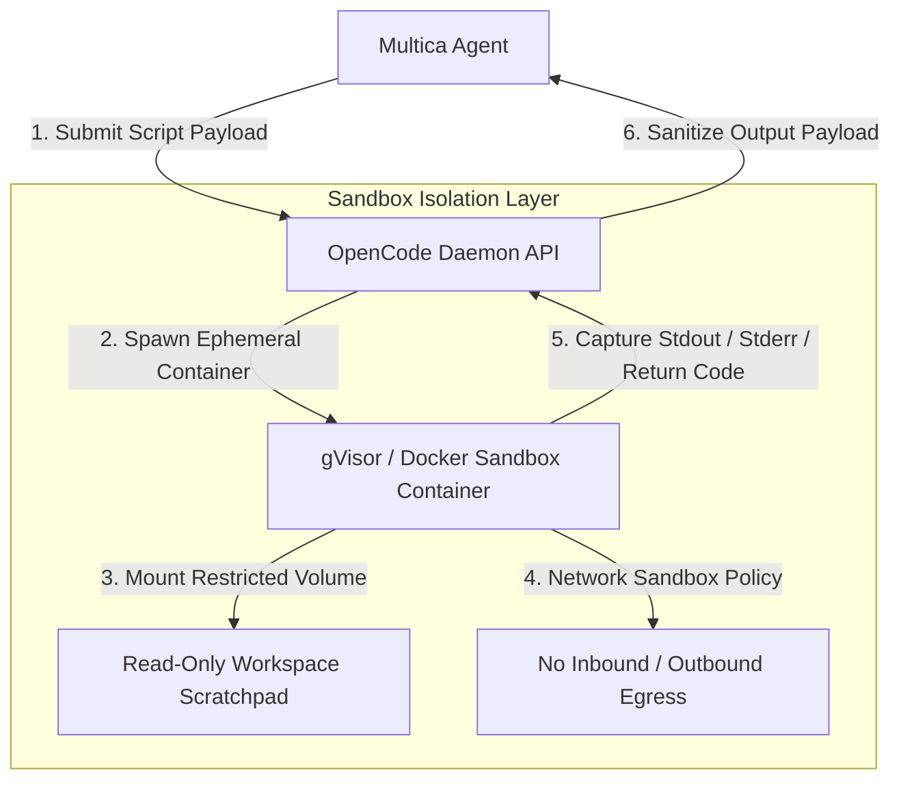

# OpenCode Sandboxed Execution Environment Setup

This document details the configuration and architecture of **OpenCode Runtime**, a sandboxed code interpreter engine that allows autonomous agents to safely synthesize and execute dynamic scripts (Python, JavaScript, Shell) in isolated containerized processes.

---

## 🔒 1. Security Architecture & Isolation

Executing dynamic AI-generated code directly on host machines poses severe security risks (unintended file deletion, network data exfiltration, process hijacking). OpenCode addresses this through multi-layer isolation:



---

## ⚙ 2. OpenCode Configuration (`opencode.config.json`)

```json
{
  "runtime": {
    "engine": "docker-gvisor",
    "memoryLimitMb": 512,
    "cpuQuota": 1.0,
    "timeoutSeconds": 30,
    "maxOutputBytes": 1048576
  },
  "interpreters": {
    "python": {
      "binary": "/usr/local/bin/python3",
      "allowedImports": ["math", "json", "re", "requests", "pandas", "numpy"],
      "blockedModules": ["os", "sys", "subprocess", "socket"]
    },
    "javascript": {
      "binary": "/usr/local/bin/node",
      "allowedModules": ["fs/promises", "path", "crypto"]
    }
  },
  "network": {
    "allowInternet": false,
    "allowedDomains": []
  }
}
```

---

## 💻 3. Interpreter Integration API

Agents interact with OpenCode via the standard MCP tool schema `opencode_interpreter`:

### Execution Request Input Schema
```json
{
  "language": "python",
  "code": "import math\n\ndef calculate_fibonacci(n):\n    fib = [0, 1]\n    for i in range(2, n):\n        fib.append(fib[-1] + fib[-2])\n    return fib[:n]\n\nprint(calculate_fibonacci(10))"
}
```

### Execution Response Payload
```json
{
  "status": "SUCCESS",
  "exitCode": 0,
  "stdout": "[0, 1, 1, 2, 3, 5, 8, 13, 21, 34]\n",
  "stderr": "",
  "executionTimeMs": 142
}
```
