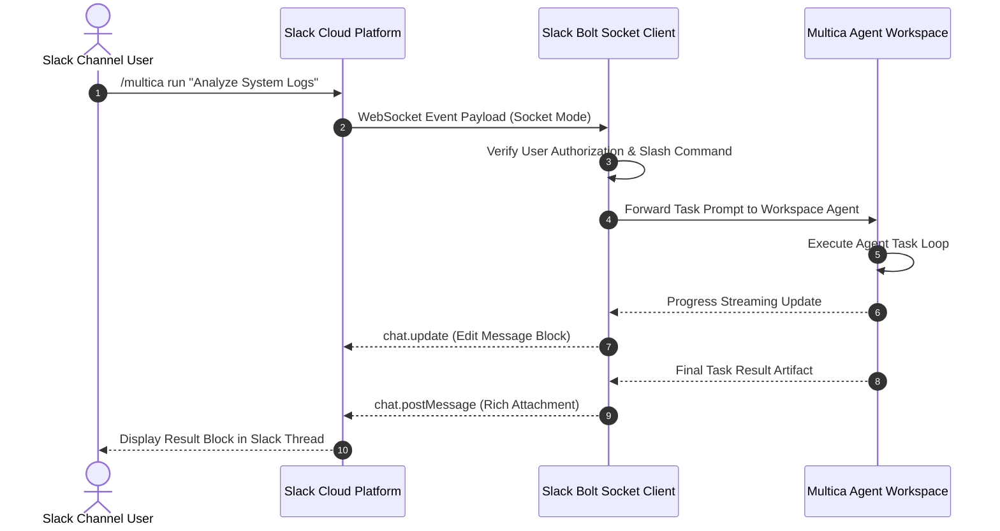

# Slack App Socket Mode Integration for Multica Workspace

This document covers connecting a **Multica Workspace** to a **Slack App** using Socket Mode, allowing real-time chat trigger handling, interactive slash commands, and status streaming without exposing public webhook endpoints.

---

## ⚡ 1. Architecture Overview



---

## 🛠 2. App Manifest Configuration (`slack_manifest.json`)

```json
{
  "display_information": {
    "name": "Multica Agent Bot",
    "description": "Interactive Slack gateway for Multica Agentic Workflows",
    "background_color": "#1A1D21"
  },
  "features": {
    "bot_user": {
      "display_name": "Multica Bot",
      "always_online": true
    },
    "slash_commands": [
      {
        "command": "/multica",
        "description": "Trigger a Multica workspace agent task",
        "usage_hint": "[prompt]",
        "should_escape": false
      }
    ]
  },
  "oauth_config": {
    "scopes": {
      "bot": [
        "commands",
        "chat:write",
        "files:write",
        "channels:history"
      ]
    }
  },
  "settings": {
    "socket_mode_enabled": true
  }
}
```

---

## 💻 3. Socket Mode Integration Server (`slack_gateway.js`)

```javascript
const { App } = require('@slack/bolt');
const { MulticaClient } = require('@multica/sdk');

const app = new App({
  token: process.env.SLACK_BOT_TOKEN,
  appToken: process.env.SLACK_APP_TOKEN,
  socketMode: true,
});

const multica = new MulticaClient({
  endpoint: 'http://localhost:8080',
  workspaceId: 'ws-agentic-ai-2026'
});

app.command('/multica', async ({ command, ack, respond, client }) => {
  await ack();

  const userPrompt = command.text;
  const channelId = command.channel_id;

  const initialMsg = await client.chat.postMessage({
    channel: channelId,
    text: `⏳ **Multica Agent Dispatched:** *"${userPrompt}"*`
  });

  try {
    const result = await multica.runAgent({
      agentId: 'orchestrator-lead-01',
      prompt: userPrompt,
      onProgress: async (status) => {
        await client.chat.update({
          channel: channelId,
          ts: initialMsg.ts,
          text: `🔄 **Multica Agent Processing:** ${status}`
        });
      }
    });

    await client.chat.update({
      channel: channelId,
      ts: initialMsg.ts,
      text: `✅ **Multica Task Complete:**\n\n\`\`\`${result.output}\`\`\``
    });
  } catch (error) {
    await client.chat.update({
      channel: channelId,
      ts: initialMsg.ts,
      text: `❌ **Execution Error:** ${error.message}`
    });
  }
});

(async () => {
  await app.start();
  console.log('⚡ Multica Slack Socket Mode Gateway is running!');
})();
```
