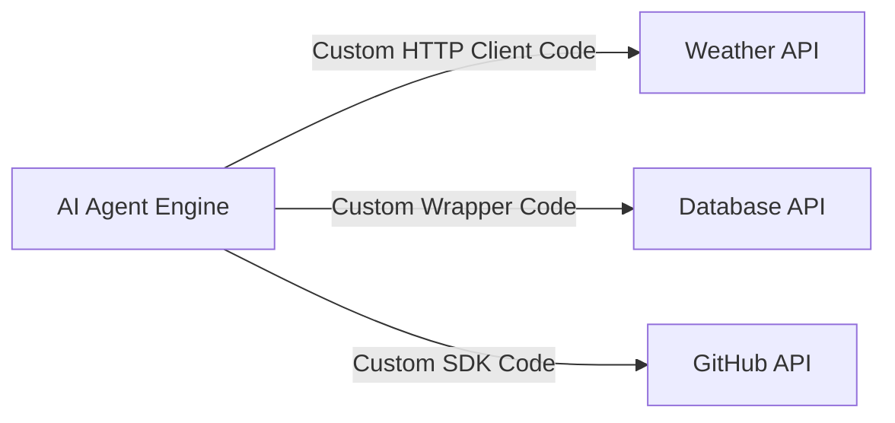
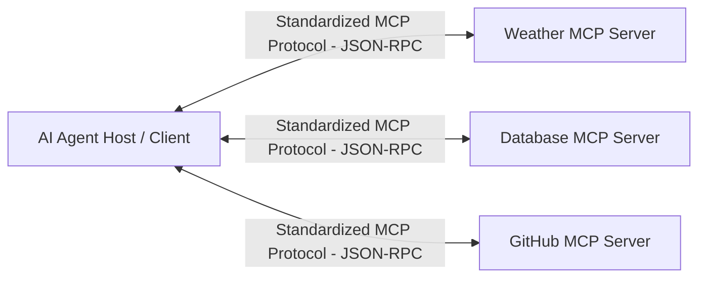

# Architectural Analysis: Traditional REST/GraphQL APIs vs Model Context Protocol (MCP)

This document provides a comprehensive architectural deep-dive comparing traditional **Application Programming Interfaces (APIs)** against the **Model Context Protocol (MCP)** for building agentic AI ecosystems.

---

## 🌐 1. Traditional REST/GraphQL APIs

### Architecture
Traditional APIs connect software applications via HTTP requests (GET, POST, PUT, DELETE) transmitting JSON/XML payloads. In an agent context, an LLM must be taught how to construct HTTP endpoints, set specific headers, deserialize custom response schemas, and handle error codes individually for every unique service.

### Benefits
- **Universal Industry Adoption**: Supported by virtually all web services worldwide.
- **Granular Protocol Control**: Complete control over HTTP headers, caching, streaming, and custom status codes.
- **Direct Edge Routing**: Can be invoked directly from frontend or backend services without intermediary protocols.

### Limitations
- **N×M Integration Complexity**: Adding N APIs to M LLMs requires custom integration wrapper code for every pair.
- **High Prompt Context Overhead**: API documentation, OpenAPI specs, and response schemas must be manually injected into system prompts.
- **Lack of Standard Tool Discovery**: No native protocol mechanism for an agent to dynamically discover available endpoints, parameters, or resources at runtime.

---

## ⚡ 2. Model Context Protocol (MCP)

### Architecture
MCP is an open standard designed specifically for connecting AI models to data sources and tools. It establishes a standardized client-server relationship over JSON-RPC 2.0 transport layers (STDIO, Streamable HTTP / SSE). An MCP client (host application) connects to independent MCP servers that expose three core primitives: **Tools**, **Resources**, and **Prompts**.

### Benefits
- **Universal Standard**: One single MCP client implementation connects an agent to hundreds of existing MCP servers without custom wrapper code.
- **Dynamic Tool & Resource Discovery**: Agents auto-discover tool schemas (`tools/list`), system prompts (`prompts/list`), and file resources (`resources/list`) dynamically upon server connection.
- **Process & Security Isolation**: MCP servers run as isolated processes (STDIO) or containerized microservices, preventing tool failures or security vulnerabilities from crashing the core agent application.

### Limitations
- **Ecosystem Maturity**: Newer protocol standard compared to decade-old REST infrastructure.
- **Transport Overhead**: Requires maintaining active STDIO sub-processes or persistent SSE connections.
- **Network Boundaries**: STDIO transport is restricted to local machine execution unless wrapped in Streamable HTTP/SSE tunnels.

---

## ⚖ 3. Comprehensive Comparison Table

| Feature / Dimension | Traditional REST/GraphQL API | Model Context Protocol (MCP) |
| :--- | :--- | :--- |
| **Protocol Standard** | HTTP/1.1, HTTP/2, REST, GraphQL | JSON-RPC 2.0 over STDIO / Streamable HTTP |
| **Tool Discovery** | Manual OpenAPI spec parsing / Custom code | Dynamic Protocol Handshake (`tools/list`) |
| **Integration Cost** | High (Requires custom SDK or wrapper code per endpoint) | Extremely Low (Pluggable JSON configuration) |
| **Security Isolation** | In-process execution (Key exposed in application context) | Isolated process (Keys scoped strictly inside server process) |
| **LLM Context Optimization** | Heavy (Manual schema formatting in system prompt) | Native (Automatic JSON-Schema payload formatting) |
| **Primitives Supported** | Raw HTTP Actions | Tools (Functions), Resources (Data), Prompts (Templates) |
| **State Management** | Ephemeral HTTP or session cookies | Stateful JSON-RPC session connection |
