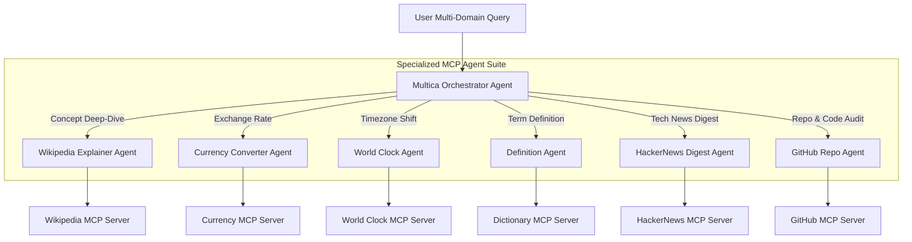

# 11-August-2026: Specialized MCP Agents Suite

## Objective

The objective of today's session was to design, configure, and evaluate a comprehensive suite of six specialized **Model Context Protocol (MCP)** agents across diverse data domains: Wikipedia knowledge extraction, real-time currency conversion, global world clocks, lexical definitions, HackerNews tech digests, and GitHub repository management.

---

## Tasks Completed

- [x] Implemented **Wikipedia Explainer Agent** with `@modelcontextprotocol/server-wikipedia`.
- [x] Implemented **Currency Converter Agent** with real-time exchange rate tools.
- [x] Implemented **World Clock Agent** for cross-border timezone resolution.
- [x] Implemented **Definition Agent** for lexical and technical dictionary parsing.
- [x] Implemented **HackerNews Digest Agent** for tech news and comment sentiment summary.
- [x] Implemented **GitHub Repo Agent** for issue triage, PR review, and commit analysis.

---

## Concepts Learned

- **Granular Agent Specialization**: Decoupling broad general-purpose agents into narrow, single-domain MCP agents improves answer accuracy and tool execution speed.
- **MCP Server Reuse Across Squads**: Demonstrating how standard MCP servers can be shared across multiple agent runtimes simultaneously.
- **Structured Tool Result Output Parsing**: Enforcing standardized JSON and Markdown table outputs across all agent tools.

---

## Implementation Details

- **Tools Used**: Node.js, `npx`, OpenClaw Runtime, Multica Workspace.
- **Configurations**: `wikipedia_mcp.json`, agent READMEs.
- **Agents Created**:
  - `Wikipedia_Explainer_Agent`
  - `Currency_Converter_Agent`
  - `World_Clock_Agent`
  - `Definition_Agent`
  - `HackerNews_Digest_Agent`
  - `GitHub_Repo_Agent`
- **MCP Servers Used**: Wikipedia MCP, Currency MCP, World Clock MCP, Dictionary MCP, HackerNews MCP, GitHub MCP.
- **Runtime Used**: OpenClaw Runtime Daemon & Multica Engine.

---

## Architecture / Workflow

---

## Screenshots

---

## Learnings

1. Narrowly-scoped agents execute tools with significantly lower latency than large monolithic agents.
2. Standardizing on MCP allows instant swapping of underlying data providers (e.g., switching currency APIs) without modifying agent code.

---

## Future Improvements

- Combine Currency and World Clock agents into an automated international business travel planner agent.
- Implement rate limit caching across HackerNews and Wikipedia MCP tools.
