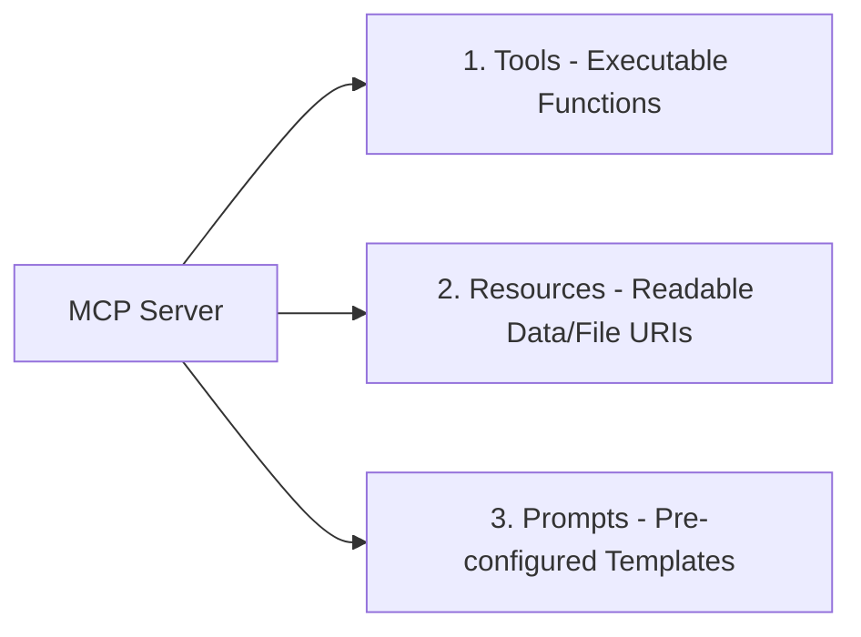

# Model Context Protocol (MCP): Comprehensive Architecture & Primitives Research Paper

This paper synthesizes research into the **Model Context Protocol (MCP)** open standard, analyzing its core architecture, client-server design primitives, tool calling semantics, resource models, and prompt template schemas.

---

## ❓ 1. What is MCP?

The **Model Context Protocol (MCP)** is an open, standardized communication protocol designed to connect Large Language Model (LLM) applications (hosts/clients) with external data sources, local binaries, databases, and API tools (servers) in a secure, uniform manner. Introduced by Anthropic in late 2024, MCP acts as the "USB-C port for AI applications."

---

## 💡 2. Why MCP Exists: The Integration Problem

Before MCP, connecting AI models to external systems suffered from fragmentation:

```
+-----------------------------------------------------------------------------------+
| THE N×M INTEGRATION CRISIS                                                        |
| If there are N AI Applications (Claude Desktop, OpenClaw, Multica, VSCode)        |
| and M Data Tools (Postgres, GitHub, Slack, AccuWeather, Brave Search):            |
| -> Developers must build N × M custom integration wrappers!                       |
+-----------------------------------------------------------------------------------+
```

### Key Drivers for MCP Standard Adoption
1. **Elimination of Custom Wrapper Code**: An MCP-compliant tool server works immediately with *any* MCP-compliant host application.
2. **Context Standardization**: Converts disparate data structures into unified JSON-Schema formats for LLM prompt insertion.
3. **Security Boundaries**: Keeps sensitive credentials (database strings, API tokens) isolated inside tool server processes rather than leaking into LLM contexts.

---

## 🏗 3. MCP High-Level Architecture

MCP utilizes a **Client-Server Architecture** operating over JSON-RPC 2.0.

```mermaid
graph TD
    subgraph Host Application (MCP Client Layer)
        Host[Claude Desktop / Multica Engine / OpenClaw]
        ClientSDK[MCP Client SDK]
        Host --> ClientSDK
    end

    subgraph Protocol Boundary (JSON-RPC 2.0)
        Transport[STDIO Pipe OR Streamable HTTP / SSE]
    end

    subgraph External System (MCP Server Layer)
        ServerSDK[MCP Server SDK]
        ToolEngine[Tools / Resources / Prompts Implementations]
        ServerSDK --> ToolEngine
    end

    ClientSDK <==>|JSON-RPC Messages| Transport
    Transport <==>|JSON-RPC Messages| ServerSDK
```

---

## 🔌 4. MCP Clients vs MCP Servers

### MCP Clients (Hosts)
- **Role**: Applications that initiate connections, manage agent execution, and format LLM prompts.
- **Responsibilities**: Discovers server capabilities, invokes tools based on LLM intent, renders resources into the context window, handles user authorization.
- **Examples**: Multica Desktop, OpenClaw Runtime, Claude Desktop, Cursor IDE.

### MCP Servers
- **Role**: Lightweight background processes exposing specific computational tools or data sources.
- **Responsibilities**: Responds to capability inquiries, executes underlying function calls, retrieves database records, streams diagnostic logs.
- **Examples**: `@modelcontextprotocol/server-wikipedia`, `@modelcontextprotocol/server-github`, `@timlukahorstmann/mcp-weather`.

---

## 🧩 5. Core MCP Primitives: Tools, Resources & Prompts

MCP defines three foundational primitives exposed by servers:



### 1. Tools (Model-Controlled Executable Actions)
Tools allow LLMs to take actions or fetch dynamic data through the server.
- **JSON-RPC Methods**: `tools/list`, `tools/call`.
- **Structure**: Name, description, and `inputSchema` defined via JSON Schema.

```json
{
  "name": "fetch_weather",
  "description": "Get current weather for a city",
  "inputSchema": {
    "type": "object",
    "properties": {
      "city": { "type": "string" }
    },
    "required": ["city"]
  }
}
```

### 2. Resources (Application-Controlled Data Reading)
Resources provide a standardized way to read file contents, database tables, or live logs via URI paths (`file:///`, `postgres://`, `memo://`).
- **JSON-RPC Methods**: `resources/list`, `resources/read`.
- **Structure**: URI, name, MIME type, text/binary content.

### 3. Prompts (User-Controlled Task Templates)
Prompts allow servers to expose pre-configured prompt templates with customizable arguments.
- **JSON-RPC Methods**: `prompts/list`, `prompts/get`.
- **Use Case**: Providing standardized code review or bug auditing templates directly from the tool server.
