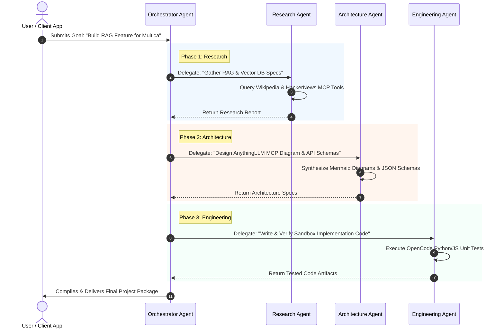

# Multica Squad Architecture & Delegation Framework

This document outlines the production **Multica Squad Architecture**, establishing a multi-agent hierarchy consisting of a lead **Orchestrator Agent** and specialized worker agents across **Research**, **Architecture**, and **Engineering**.

---

## 🏗 1. Squad Architecture Diagram

```mermaid
graph TD
    Orchestrator[Orchestrator Agent]
    Research[Research Agent]
    Architecture[Architecture Agent]
    Engineering[Engineering Agent]

    Orchestrator -->|Delegates Context Retrieval| Research
    Orchestrator -->|Delegates System Blueprint| Architecture
    Orchestrator -->|Delegates Implementation & Testing| Engineering

    Research -->>Orchestrator: Market & Technical Research Findings
    Architecture -->>Orchestrator: System Blueprints & Interface Specs
    Engineering -->>Orchestrator: Verified Code & Test Artifacts
```

### Exact Squad Hierarchy Structure

```
         Orchestrator Agent
                 |
                 |
 ---------------------------------
 |               |               |
Research    Architecture    Engineering
```

---

## 👥 2. Squad Creation & Role Breakdown

The squad is initialized in Multica via `multica squad create --config squad.json`:

### Role Specifications & Capabilities

| Squad Role | Agent ID | Model Provider | Key Tools & Skills Assigned |
| :--- | :--- | :--- | :--- |
| **Orchestrator Agent** | `squad-orchestrator-lead` | `gpt-4o` | `delegate_task`, `evaluate_subtask`, `synthesize_final_output` |
| **Research Agent** | `squad-worker-research` | `claude-3-5-sonnet` | `wikipedia_search`, `hackernews_digest`, `web_search` |
| **Architecture Agent** | `squad-worker-arch` | `claude-3-5-sonnet` | `generate_mermaid_diagram`, `spec_validator` |
| **Engineering Agent** | `squad-worker-eng` | `gpt-4o` | `opencode_interpreter`, `github_repo_tool`, `unit_tester` |

---

## 🔄 3. Inter-Agent Coordination & Delegation Workflow



---

## ⚙ 4. Squad Configuration (`squad.json`)

```json
{
  "squadName": "Multica-Core-Engineering-Squad",
  "leadAgentId": "squad-orchestrator-lead",
  "coordinationStrategy": "phase-gated-sequential",
  "agents": [
    {
      "agentId": "squad-orchestrator-lead",
      "role": "Orchestrator",
      "systemPrompt": "You are Orchestrator Lead. Decompose user requests into Research, Architecture, and Engineering sub-tasks. Validate outputs before advancing phases."
    },
    {
      "agentId": "squad-worker-research",
      "role": "Research",
      "systemPrompt": "You are Research Agent. Conduct deep-dive context retrieval using assigned MCP tools."
    },
    {
      "agentId": "squad-worker-arch",
      "role": "Architecture",
      "systemPrompt": "You are Architecture Agent. Convert research findings into clean system diagrams and API schemas."
    },
    {
      "agentId": "squad-worker-eng",
      "role": "Engineering",
      "systemPrompt": "You are Engineering Agent. Synthesize code and run sandboxed tests via OpenCode runtime."
    }
  ]
}
```
