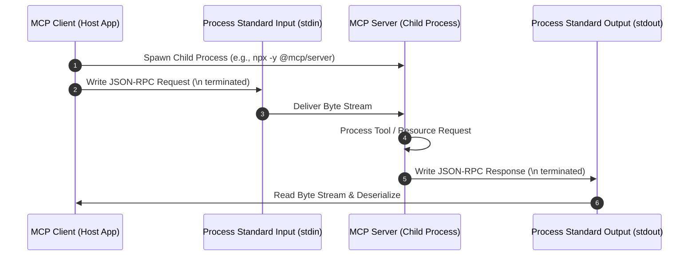
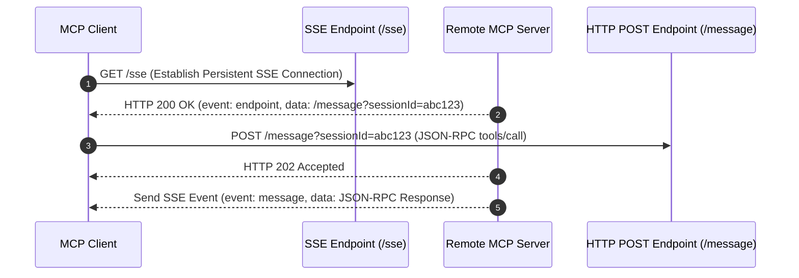

# MCP Transport Protocol Deep-Dive: STDIO vs Streamable HTTP

The **Model Context Protocol (MCP)** defines how AI host applications (clients) communicate with external tool providers (servers). MCP specifies two standard transport mechanisms: **Standard Input/Output (STDIO)** and **Streamable HTTP (using Server-Sent Events / SSE)**.

---

## 📟 1. STDIO Transport Architecture

### Overview & Architecture
STDIO transport runs the MCP server as a child process launched directly by the host application. Communication occurs over standard OS inter-process communication (IPC) pipes: `stdin` for writing JSON-RPC requests to the server, and `stdout` for receiving JSON-RPC responses.

### Communication Flow
1. **Handshake**: Host spawns child process, sends `initialize` JSON-RPC method over `stdin`.
2. **Capability Exchange**: Server responds on `stdout` with supported tools, resources, and prompts.
3. **Execution**: Host sends `tools/call`, server executes and returns result JSON on `stdout`.
4. **Stderr Isolation**: Server logs diagnostics to `stderr` to prevent corrupting the `stdout` JSON stream.

### Advantages
- **Zero Network Setup**: No IP addresses, port allocation, or firewall configurations required.
- **Ultra-Low Latency**: Direct operating system pipe IPC avoids TCP/IP protocol overhead.
- **Inherited Security Sandbox**: The host process completely controls environment variables and process lifetime.

### Limitations
- **Local Machine Only**: Client and server MUST run on the same physical or virtual host.
- **Process Spawning Overhead**: Spawning multiple `npx` child processes can consume host CPU/Memory.
- **No Shared Multi-Client Access**: Each child process is dedicated to a single host client instance.

---

## 🌐 2. Streamable HTTP (SSE) Transport Architecture

### Overview & Architecture
Streamable HTTP transport decouples the client and server over standard HTTP networking. It uses **Server-Sent Events (SSE)** for streaming server-to-client notifications/responses, combined with HTTP `POST` endpoints for client-to-server request dispatching.

### Communication Flow
1. **Session Handshake**: Client initiates an HTTP GET request to `/sse`.
2. **Endpoint Discovery**: Server responds with an SSE event containing a unique session URI for posting requests (`/message?sessionId=xyz`).
3. **Request Dispatch**: Client sends JSON-RPC requests via HTTP POST to the returned session URI.
4. **Streaming Response**: Server processes the request and streams the JSON-RPC response back over the established SSE connection.

### Advantages
- **Remote / Cloud-Native**: Client and server can run on separate cloud servers, Kubernetes clusters, or edge nodes.
- **Multi-Tenant / Shared Access**: Multiple agent clients can connect to a single centralized cloud MCP server.
- **Scalability**: MCP servers can be horizontally scaled behind standard load balancers.

### Limitations
- **Network Overhead**: Encounters network latency, TLS negotiation, and potential packet drops.
- **Connection Management**: Requires maintaining persistent SSE TCP sockets and reconnect logic.
- **Authentication Requirements**: Demands explicit network security (OAuth, API Keys, TLS certs).

---

## ⚖ 3. Architectural Comparison Matrix

| Feature / Dimension | STDIO Transport | Streamable HTTP (SSE) Transport |
| :--- | :--- | :--- |
| **Execution Context** | Same host / Local process | Distributed / Network cloud endpoints |
| **Protocol Plumbing** | OS Pipes (`stdin` / `stdout`) | HTTP/1.1 or HTTP/2 + SSE (`GET` / `POST`) |
| **Performance Latency** | Instant (~1–5 ms) | Network dependent (~50–250 ms) |
| **Setup Complexity** | Zero configuration | Requires server hosting, ports, & TLS |
| **Target Use Case** | Local desktop agents, developer tooling | Enterprise cloud squad agents, SaaS tools |
