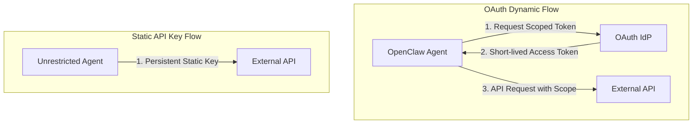

# Authentication Paradigms for Autonomous Agents: OAuth vs API Key

In autonomous agent systems (such as Multica and OpenClaw), agents frequently interact with external APIs, cloud services, and internal enterprise databases. Decoupling authentication mechanics and selecting the appropriate security architecture is critical to preventing unauthorized privilege escalation and key leaks.

---

## 🔑 1. OAuth Dynamic Key Architecture

OAuth 2.0 dynamic key authorization relies on programmatic token exchanges via authorization servers. Instead of hardcoding credentials, the agent obtains short-lived scoped tokens through grant flows such as **Client Credentials Grant** or **Proof Key for Code Exchange (PKCE)**.

### Mechanics
1. The agent authenticates against an Identity Provider (IdP) using its client ID and encrypted secret/private key pair.
2. The IdP issues a JSON Web Token (JWT) or opaque access token with a strict expiration window (e.g., 15–60 minutes) and specific scope boundaries (e.g., `read:weather`, `write:repo`).
3. When the token expires, the agent uses a **Refresh Token** or re-authenticates dynamically without human intervention.

---

## 🎟 2. OAuth Session Based Key

Session-based OAuth bindings bind access tokens to ephemeral agent execution sessions. 

### Mechanics
1. When an agent squad initializes a multi-task execution loop, a unique **Session Key** is provisioned.
2. The key is cryptographically tied to the session ID, target workspace, and active sub-agent processes.
3. Upon task completion, process termination, or error threshold breach, the session key is immediately revoked on the OAuth authorization server, rendering intercepted tokens useless.

---

## 📌 3. API Key Static Authentication

Static API Key authentication uses long-lived alphanumeric strings passed via HTTP headers (e.g., `Authorization: Bearer <API_KEY>` or `X-API-Key: <API_KEY>`).

### Mechanics
1. The developer generates a static key from a service provider console (e.g., OpenAI, AccuWeather).
2. The key is injected into the agent environment via environment variables (`.env`) or configuration files.
3. The agent passes the exact same string across all execution cycles indefinitely until manually rotated by an admin.

---

## ⚖ 4. Detailed Advantages & Disadvantages Comparison

| Parameter | OAuth Dynamic / Session Keys | Static API Keys |
| :--- | :--- | :--- |
| **Token Lifetime** | Ephemeral (Minutes to Hours) | Long-lived (Months to Indefinite) |
| **Revocation Granularity** | Fine-grained (Per session, per scope, or per agent instance) | Coarse-grained (Global revocation affects all instances) |
| **Blast Radius on Leak** | Minimal (Token expires quickly; scope limited) | Severe (Full privilege compromise until manual detection) |
| **Implementation Complexity** | High (Requires token store, refresh logic, IdP integration) | Very Low (Header string insertion) |
| **Suitability for Autonomous Agents** | High (Ideal for multi-agent squads and public cloud agents) | Medium/Low (Best restricted to local developer testing) |

---

## 🔒 5. Comprehensive Security Comparison Matrix



### Security Trade-Off Analysis

```
+-------------------------------------------------------------------------------+
| CRITICAL SECURITY AUDIT FINDING                                              |
| Static API Keys stored in agent memory or local JSON configs pose high risk  |
| of unintended log leaks during telemetry trace exports.                      |
+-------------------------------------------------------------------------------+
```

1. **Replay Attack Vulnerability**: Static API keys are vulnerable to network interception and logging exposure. OAuth dynamic tokens utilize cryptographic signatures and short expiry windows to mitigate replay risk.
2. **Principle of Least Privilege (PoLP)**: OAuth enables granular scoping (e.g., granting a scraper agent read-only access to a specific endpoint), whereas static API keys often grant full account permissions.
3. **Auditability & Traceability**: Session-based OAuth logs attribute action traces directly to individual agent session IDs, enabling automated forensic isolation during security incidents.
