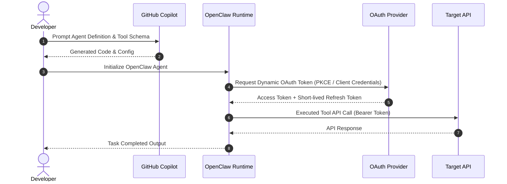

# 29-July-2026: Foundation, Authentication & OpenClaw Agent Setup

## Objective

The objective of this session was to establish the foundational authentication security model for agentic systems, evaluate GitHub Copilot for agent development, and initialize the OpenClaw agent runtime environment.

---

## Tasks Completed

- [x] Analyzed authentication paradigms: OAuth Dynamic & Session Keys vs Static API Key authentication.
- [x] Evaluated GitHub Copilot Agent Development workflows, strengths, limitations, and developer friction points.
- [x] Installed and configured the **OpenClaw** agent framework on local environment.
- [x] Completed initial agent onboarding and execution validation.

---

## Concepts Learned

- **Token Lifecycle & Key Rotations**: Understanding short-lived OAuth bearer tokens vs long-lived static API tokens in agent-to-service communication.
- **Agent Developer Context Windows**: How GitHub Copilot parses repository workspace context and where it hits cognitive limits in complex agent orchestration.
- **OpenClaw Daemon & Runtime Architecture**: The core architecture of OpenClaw for local process isolation and agent lifecycle state management.

---

## Implementation Details

- **Tools Used**: Node.js v20+, OpenClaw CLI, GitHub Copilot Extension, cURL, OpenSSL.
- **Configurations**: Environment variables (`.env`), JSON authentication credentials, OpenClaw configuration file (`openclaw.config.json`).
- **Agents Created**: Initial OpenClaw Bootstrap Agent (`bootstrap-agent-01`).
- **MCP Servers Used**: N/A (Evaluated foundational auth primitives).
- **Runtime Used**: OpenClaw Node.js Local Daemon Runtime.

---

## Architecture / Workflow

---

## Screenshots

---

## Learnings

1. Static API keys introduce severe security vulnerability vectors in distributed agent deployment due to persistent privilege exposure.
2. Copilot excels at unit-level function generation but requires structured human guidance when configuring multi-agent state boundaries.
3. OpenClaw provides robust process isolation out-of-the-box, making it ideal for self-hosted agent automation.

---

## Future Improvements

- Implement automated OAuth token refresh hooks inside OpenClaw custom middleware.
- Create automated linting rules for Copilot-generated agent tool definitions.
