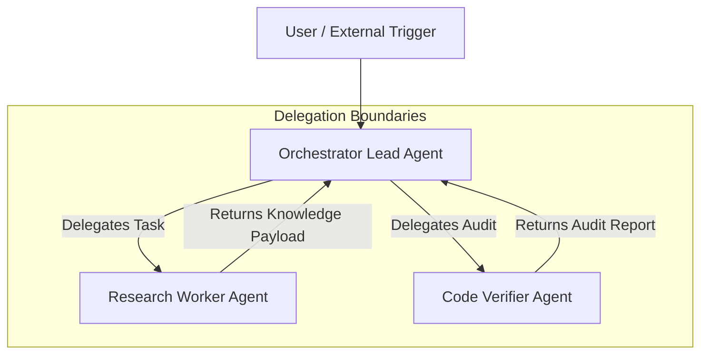

# OpenClaw Multi-Agent Team Architecture & Delegation Guide

This document outlines the step-by-step design, role breakdown, inter-agent communication, and task delegation mechanics of a production multi-agent squad built on **OpenClaw**.

---

## 👥 1. Squad Composition & Role Definition

A robust agent team requires clean separation of concerns. In our OpenClaw deployment, we establish three distinct operational roles:



### Role Specifications

| Role | Agent ID | System Prompt Focus | Tool Permissions |
| :--- | :--- | :--- | :--- |
| **Orchestrator Lead** | `orchestrator-lead-01` | Problem decomposition, sub-task dispatching, synthesis of final responses. | `delegate_task`, `agent_status`, `read_state` |
| **Research Worker** | `research-worker-01` | Information retrieval, web scraping, document extraction, summary generation. | `web_search`, `fetch_page`, `write_artifact` |
| **Code Verifier** | `code-verifier-01` | Code review, linting, unit test execution, security vulnerability verification. | `run_sandbox_code`, `git_diff`, `linter` |

---

## 🛠 2. Agent Creation Configuration

The team configuration is declared in `squad.config.json`:

```json
{
  "squadName": "Engineering-Research-Squad",
  "orchestratorId": "orchestrator-lead-01",
  "agents": [
    {
      "agentId": "orchestrator-lead-01",
      "model": "gpt-4o",
      "temperature": 0.1,
      "maxTokens": 4096,
      "capabilities": ["orchestration", "delegation"]
    },
    {
      "agentId": "research-worker-01",
      "model": "claude-3-5-sonnet",
      "temperature": 0.3,
      "capabilities": ["web_retrieval", "documentation"]
    },
    {
      "agentId": "code-verifier-01",
      "model": "gpt-4o",
      "temperature": 0.0,
      "capabilities": ["code_verification", "syntax_linting"]
    }
  ]
}
```

---

## ✉ 3. Inter-Agent Communication Protocol

Agents communicate via the OpenClaw RPC interface using standardized event objects.

### Delegation Request Payload
```json
{
  "rpcMethod": "claw.agent.delegate",
  "params": {
    "targetAgentId": "research-worker-01",
    "taskPayload": {
      "query": "Research Model Context Protocol (MCP) STDIO transport spec",
      "format": "markdown_summary"
    },
    "timeoutMs": 60000
  }
}
```

---

## 📋 4. End-to-End Task Delegation Workflow

1. **User Request Received**: User sends request to `orchestrator-lead-01`.
2. **Task Decomposition**: `orchestrator-lead-01` splits prompt into Sub-Task A (Research) and Sub-Task B (Verification).
3. **Execution & Synthesis**:
   - `research-worker-01` executes `web_search` and returns findings to `orchestrator-lead-01`.
   - `orchestrator-lead-01` passes code generated from research to `code-verifier-01`.
   - `code-verifier-01` runs unit tests in sandboxed environment and approves output.
4. **Final Assembly**: `orchestrator-lead-01` compiles unified result and returns to User.
