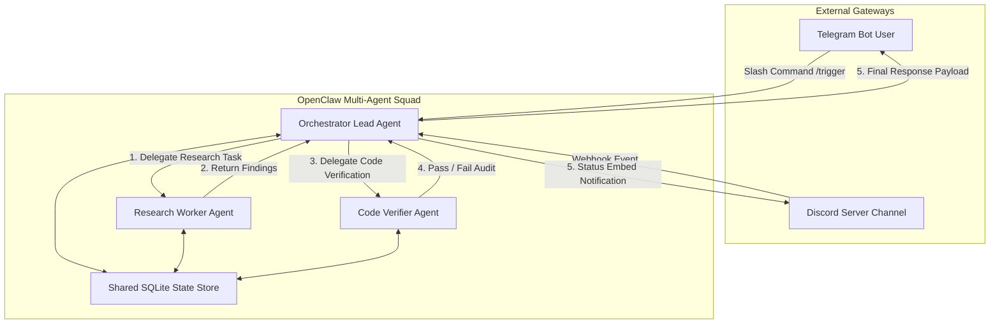

# 30-July-2026: OpenClaw Multi-Agent Teams & Bot Gateways

## Objective

The objective of today's session was to explore multi-agent topology patterns in OpenClaw, implement inter-agent communication and task delegation workflows, and integrate external messaging channels (Telegram & Discord) as agent control planes.

---

## Tasks Completed

- [x] Documented foundational OpenClaw multi-agent concepts in **Session_1_Notes.md**.
- [x] Documented advanced workflow patterns (state persistence, failure handling, human-in-the-loop) in **Session_2_Notes.md**.
- [x] Built and deployed an **OpenClaw Multi-Agent Team** with Orchestrator, Worker, and Verifier roles.
- [x] Implemented Telegram and Discord bot gateway experiments for remote multi-agent trigger and status tracking.

---

## Concepts Learned

- **Hierarchical Agent Delegation**: Orchestrator-worker topology vs peer-to-peer agent mesh models.
- **Inter-Agent Message Bus**: Async message passing, event queues, and state synchronization across agent processes.
- **External Bot Webhook Gateways**: Mapping Telegram bot polling and Discord WebSocket gateways to agent execution triggers.

---

## Implementation Details

- **Tools Used**: OpenClaw CLI, Node.js, Telegram Bot API, Discord.js SDK, SQLite.
- **Configurations**: `multi_agent_team.json`, `bot_gateway.config.json`.
- **Agents Created**:
  - `Orchestrator-Lead-01`
  - `Research-Worker-01`
  - `Code-Verifier-01`
- **MCP Servers Used**: N/A (Focused on native multi-agent message passing).
- **Runtime Used**: OpenClaw Multi-Process Node.js Daemon.

---

## Architecture / Workflow

---

## Screenshots

---

## Learnings

1. Strict role boundary definition in system prompts prevents agent infinite delegation loops.
2. Async event queues between agents are essential to prevent blocking main thread operations during long-running sub-tasks.
3. Bot gateways require authorization middleware to prevent unauthorized users from executing arbitrary agent tasks.

---

## Future Improvements

- Add end-to-end token counting per sub-agent to optimize multi-agent task execution costs.
- Implement automated heartbeat monitoring for remote Telegram and Discord gateway webhooks.
