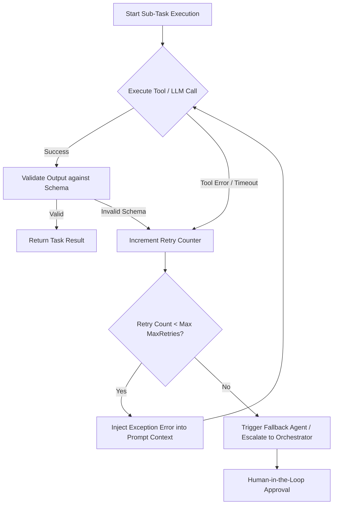

# Session 2 Notes: Advanced Agent Workflows & Fault Tolerance

This document explores advanced workflow patterns within autonomous agent frameworks, covering conditional branching, dynamic retry loops, state persistence, and human-in-the-loop (HITL) execution controls.

---

## 🔄 1. Dynamic Retry & Failure Recovery Workflows

In real-world environments, agent execution frequently fails due to rate limits, tool execution errors, malformed syntax, or network timeouts.



### Self-Correction Strategy
When an execution error occurs:
1. Capture the raw error trace, exit code, or JSON validation failure.
2. Formulate a **Self-Correction Prompt Chunk**:
   ```
   [SYSTEM FEEDBACK]: Your previous call to tool 'run_code' failed with syntax error at Line 14: Uncaught ReferenceError: 'data' is not defined. Please correct line 14 and retry.
   ```
3. Re-evaluate execution up to `maxRetries = 3`.

---

## ⏹ 2. Human-In-The-Loop (HITL) Checkpoints

For high-risk agent tools (such as database migrations, financial transactions, or production deployments), OpenClaw enforces strict **Human-in-the-Loop gating**.

```
+-----------------------------------------------------------------------------------+
| HITL SECURITY INTERCEPTOR TRIGGERED                                               |
| Agent 'engineering-worker-01' requests tool execution: 'deploy_to_production'     |
| Target Environment: Production Cluster US-East-1                                  |
| Status: WAITING FOR HUMAN APPROVAL [Approve (y) / Reject (n)]                      |
+-----------------------------------------------------------------------------------+
```

### Protocol Implementation
- Tools are tagged with `"requiresApproval": true` in `agent.config.json`.
- The daemon pauses execution, serializes the context snapshot to database, and emits an alert via CLI/Slack/Telegram.
- Upon human command `openclaw approve <task_id>`, execution resumes.

---

## 💾 3. State Persistence & Process Checkpointing

OpenClaw implements automatic checkpointing after every successful tool invocation:
- **State Snapshot**: Serializes current variable bindings, intermediate files, and active agent execution status to SQLite.
- **Resumption capability**: If the host process restarts, OpenClaw reloads the latest snapshot from disk and resumes without re-executing completed idempotent tool steps.
