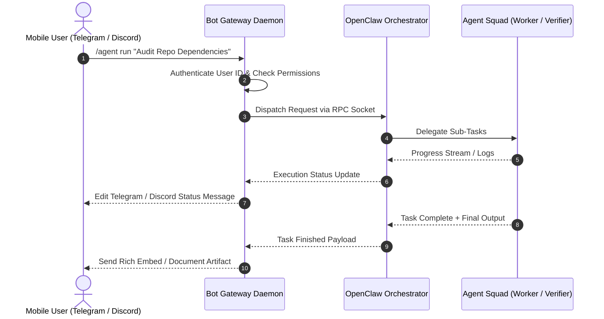

# Telegram & Discord Bot Remote Agent Gateway Experiment

This document details the architectural integration of **Telegram Bot API** and **Discord Gateway/Webhooks** with the **OpenClaw** multi-agent runtime to enable remote command triggers, status streaming, and interactive approval flows over mobile and desktop messaging apps.

---

## 🌐 1. Architecture Overview



---

## 🤖 2. Telegram Bot Gateway Setup

### Configuration (`telegram.gateway.json`)
```json
{
  "botToken": "7192840192:AAFxEXAMPLE_TELEGRAM_KEY",
  "allowedChatIds": [102938475, 987654321],
  "openclawPort": 7432,
  "commandPrefix": "/agent"
}
```

### Handler Code Snippet (`gateway_telegram.js`)
```javascript
const { Telegraf } = require('telegraf');
const bot = new Telegraf(process.env.TELEGRAM_BOT_TOKEN);

bot.command('agent', async (ctx) => {
  const userId = ctx.from.id;
  const prompt = ctx.message.text.replace('/agent', '').trim();
  
  if (!isAuthorizedUser(userId)) {
    return ctx.reply('⛔ Unauthorized access denied.');
  }

  const statusMsg = await ctx.reply('⏳ Dispatching request to OpenClaw Orchestrator...');
  
  // Call OpenClaw Daemon RPC
  const response = await executeOpenClawTask(prompt, (update) => {
    ctx.telegram.editMessageText(ctx.chat.id, statusMsg.message_id, null, `🔄 Progress: ${update.status}`);
  });

  await ctx.replyWithMarkdown(`✅ **Task Completed**\n\n${response.result}`);
});

bot.launch();
```

---

## 💬 3. Discord Bot & Webhook Gateway Setup

### Gateway Integration (`gateway_discord.js`)
```javascript
const { Client, GatewayIntentBits, EmbedBuilder } = require('discord.js');
const client = new Client({ intents: [GatewayIntentBits.Guilds, GatewayIntentBits.GuildMessages, GatewayIntentBits.MessageContent] });

client.on('messageCreate', async (message) => {
  if (message.author.bot || !message.content.startsWith('!claw')) return;

  const prompt = message.content.replace('!claw', '').trim();
  const embed = new EmbedBuilder()
    .setTitle('🤖 OpenClaw Multi-Agent Task Dispatch')
    .setDescription(`Prompt: *${prompt}*`)
    .setColor(0x00FF00)
    .addFields({ name: 'Status', value: 'Queued in Orchestrator' });

  const reply = await message.channel.send({ embeds: [embed] });

  // Stream updates to Discord Embed
  const result = await streamClawExecution(prompt, async (step) => {
    embed.setFields({ name: 'Active Agent', value: step.activeAgent }, { name: 'Status', value: step.status });
    await reply.edit({ embeds: [embed] });
  });
});

client.login(process.env.DISCORD_BOT_TOKEN);
```

---

## 📊 4. Comparison & Key Takeaways

| Feature | Telegram Bot Gateway | Discord Webhook / Bot |
| :--- | :--- | :--- |
| **Primary Interaction** | Command-based private messages & group chats | Channel embeds & slash commands |
| **Status Streaming** | Message edit polling | Real-time embed edits via WebSocket |
| **Artifact Delivery** | Direct PDF / Markdown file attachment delivery | Code blocks, attachments & external links |
| **Security Mechanism** | Strict Chat ID Whitelisting | Role-Based Access Control (RBAC) per channel |
