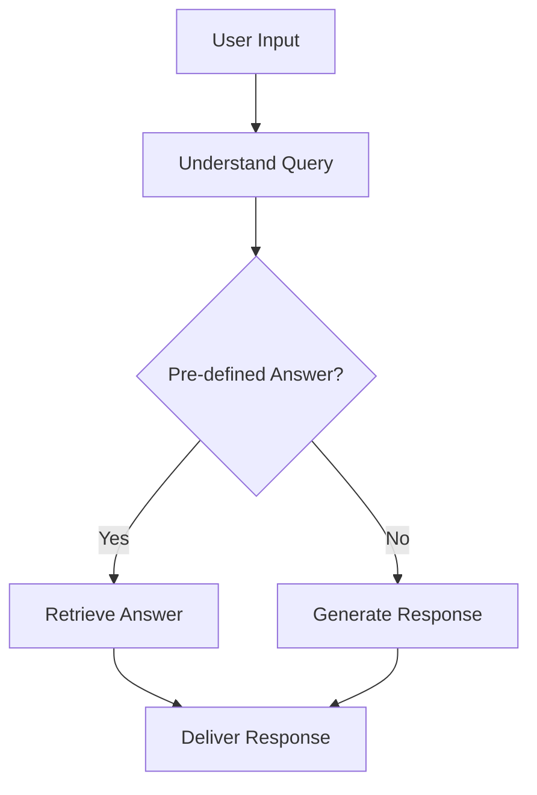
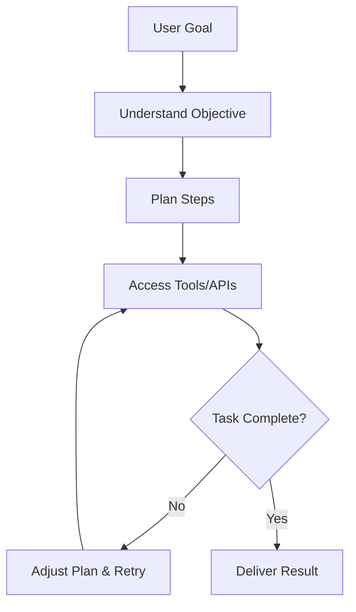

# Chatbot vs AI Agent

## Introduction

Artificial Intelligence (AI) is changing how we interact with computers. Two popular AI technologies you may have heard about are **chatbots** and **AI agents**. While they both use AI to communicate with humans, they work differently and serve different purposes.

This guide explains the key differences between chatbots and AI agents in simple terms. Whether you're a student, a developer, or just curious about AI, this article will help you understand which tool is right for your needs.

---

## What is a Chatbot?

A **chatbot** is a software program designed to simulate conversation with human users. Think of it as a digital assistant that can answer questions, provide information, and perform simple tasks through text or voice.

### How Chatbots Started

The first chatbots appeared in the 1960s. ELIZA, created in 1966, was one of the earliest examples. It could mimic a psychotherapist by rephrasing user inputs as questions. Modern chatbots like those on banking websites or customer service portals have evolved significantly but follow the same basic principle: they respond to user queries with pre-programmed or generated answers.

### What Chatbots Can Do

- Answer frequently asked questions (FAQs)
- Provide customer support 24/7
- Help users navigate websites
- Collect basic information from users
- Perform simple, repetitive tasks

### Example Use Cases

- A banking website chatbot that answers questions about account balances
- A retail store chatbot that helps customers track orders
- A healthcare chatbot that provides general medical information

---

## What is an AI Agent?

An **AI agent** is a more advanced system that can perform complex tasks, make decisions, and take actions autonomously. Unlike chatbots, which mainly respond to queries, AI agents can plan, reason, and use tools to achieve goals.

### The Evolution to AI Agents

AI agents represent the next step in AI evolution. While chatbots focus on conversation, AI agents focus on **action**. They can break down complex problems, use various tools and APIs, and even perform multi-step workflows without constant human input.

### What AI Agents Can Do

- Understand and execute complex, multi-step tasks
- Make decisions based on data and context
- Use external tools and APIs (like web browsers, code editors, or databases)
- Learn and adapt over time
- Work autonomously with minimal human supervision

### Example Use Cases

- An AI agent that researches a topic, summarizes findings, and creates a report
- An AI agent that manages your calendar, books meetings, and sends reminders
- An AI agent that writes, tests, and deploys code for a software project

---

## Key Differences

Here's a detailed comparison between chatbots and AI agents:

| Feature               | Chatbot                                                       | AI Agent                                               |
| --------------------- | ------------------------------------------------------------- | ------------------------------------------------------ |
| **Purpose**           | Answer questions and provide information                      | Perform tasks, make decisions, and take actions        |
| **Memory**            | Limited to the current conversation (stateless or short-term) | Can retain and use long-term memory and context        |
| **Reasoning**         | Follows pre-defined rules or simple pattern matching          | Uses advanced reasoning, planning, and problem-solving |
| **Tool Usage**        | Cannot use external tools or APIs                             | Can interact with external tools, APIs, and services   |
| **Decision Making**   | Makes no decisions; only provides responses                   | Can make autonomous decisions based on goals and data  |
| **Internet Access**   | Usually no real-time internet access                          | Can access the internet for up-to-date information     |
| **Automation**        | Limited to conversation flows                                 | Can automate complex, multi-step workflows             |
| **Human Involvement** | Requires human input for every interaction                    | Can work independently with minimal oversight          |
| **Examples**          | Simple customer service bots, FAQ bots                        | Devin, AutoGPT, AI research assistants                 |

---

## How They Work

### Chatbot Workflow

A typical chatbot follows a straightforward process:

**Step-by-Step:**

1. **User Input**: The user types or speaks a question.
2. **Understand Query**: The chatbot processes the input using natural language understanding (NLU).
3. **Check for Pre-defined Answer**: The chatbot checks if the query matches a known question in its database.
4. **Generate or Retrieve Response**: If it's a known query, it retrieves the pre-programmed answer. If not, it may use a language model to generate a response.
5. **Deliver Response**: The chatbot returns the answer to the user.

### AI Agent Workflow

An AI agent's workflow is more complex and dynamic:

**Step-by-Step:**

1. **User Goal**: The user provides a goal or task (e.g., "Research and summarize the latest AI trends").
2. **Understand Objective**: The AI agent interprets the goal and breaks it down into sub-tasks.
3. **Plan Steps**: The agent creates a step-by-step plan to achieve the goal.
4. **Access Tools/APIs**: The agent uses various tools (web search, databases, code editors) to gather information or perform actions.
5. **Check Completion**: The agent evaluates if the task is complete.
6. **Adjust or Deliver**: If the task isn't complete, the agent adjusts its plan and tries again. If it is complete, it delivers the result to the user.

---

## Real-World Examples

Here are some popular AI tools and how they classify:

| Tool               | Type                            | Explanation                                                                                                                                                                                                  |
| ------------------ | ------------------------------- | ------------------------------------------------------------------------------------------------------------------------------------------------------------------------------------------------------------ |
| **ChatGPT**        | AI Assistant (Advanced Chatbot) | Primarily a conversational AI that can answer questions, write text, and generate code. While it can perform some multi-step tasks, it lacks persistent memory and tool-use capabilities of a full AI agent. |
| **Gemini**         | AI Assistant (Advanced Chatbot) | Google's conversational AI that can understand and generate text, images, and code. It operates mainly as an advanced chatbot with some agent-like features.                                                 |
| **Claude**         | AI Assistant (Advanced Chatbot) | Anthropic's AI that excels at conversation, coding, and text generation. It can follow complex instructions but is primarily a chatbot.                                                                      |
| **GitHub Copilot** | AI Assistant                    | An AI pair programmer that suggests code in real-time. It integrates with your editor but doesn't autonomously plan or execute tasks.                                                                        |
| **Perplexity**     | AI Assistant (Search-Focused)   | A conversational AI that specializes in answering questions with real-time web search. It's more advanced than a simple chatbot but not a full agent.                                                        |
| **OpenHands**      | AI Agent                        | An open-source AI agent that can autonomously perform tasks using various tools and APIs. It can plan, execute, and adapt to achieve complex goals.                                                          |
| **Devin**          | AI Agent                        | An AI software engineer that can write, test, and deploy code autonomously. It uses tools like a code editor, terminal, and web browser to complete tasks.                                                   |

---

## When Should You Use a Chatbot?

Chatbots are ideal for scenarios where:

- You need to **answer common questions** quickly and efficiently.
- You want to **provide 24/7 customer support** without human intervention.
- Your tasks are **simple and repetitive** (e.g., order tracking, FAQs).
- You need a **low-cost, easy-to-implement** solution.
- Users expect **instant responses** to straightforward queries.

### Best Use Cases for Chatbots

✅ **Customer Support**: Handle common customer inquiries about products, services, or policies.  
✅ **FAQ Systems**: Provide instant answers to frequently asked questions on websites.  
✅ **Lead Qualification**: Collect basic information from potential customers before connecting them to a sales representative.  
✅ **Appointment Scheduling**: Help users book appointments or reservations with simple, rule-based interactions.

---

## When Should You Use an AI Agent?

AI agents shine in scenarios where:

- You need to **perform complex, multi-step tasks** (e.g., research, analysis, coding).
- You want **autonomous decision-making** based on data and context.
- Your workflows require **access to external tools and APIs** (e.g., web search, databases, code repositories).
- You need **long-term memory and context** retention across interactions.
- You want to **automate end-to-end processes** with minimal human oversight.

### Best Use Cases for AI Agents

✅ **Research &amp; Analysis**: Gather, summarize, and analyze information from multiple sources.  
✅ **Software Development**: Write, test, debug, and deploy code autonomously.  
✅ **Business Automation**: Manage workflows like report generation, data analysis, and decision-making.  
✅ **Personal Assistance**: Handle complex personal tasks like travel planning, calendar management, and project coordination.  
✅ **Creative Projects**: Generate and refine creative content (e.g., writing a book, designing a website) with iterative feedback.

---

## Advantages and Limitations

### Chatbot Advantages

✔ **Cost-Effective**: Chatbots are cheaper to develop and maintain compared to AI agents.  
✔ **Easy to Deploy**: They can be set up quickly with minimal technical expertise.  
✔ **Fast Responses**: Chatbots provide instant answers to pre-defined queries.  
✔ **Scalable**: Can handle thousands of conversations simultaneously.  
✔ **Reliable for Simple Tasks**: Excels at repetitive, rule-based interactions.

### Chatbot Limitations

✖ **Limited Capabilities**: Cannot perform complex tasks or make decisions.  
✖ **No Long-Term Memory**: Struggles to maintain context across long conversations.  
✖ **No Tool Usage**: Cannot interact with external systems or APIs.  
✖ **Brittle**: Breaks easily when faced with unexpected or complex queries.  
✖ **No Learning**: Does not improve or adapt over time without manual updates.

### AI Agent Advantages

✔ **Complex Task Execution**: Can handle multi-step, complex workflows.  
✔ **Autonomous Decision-Making**: Makes decisions based on data and goals.  
✔ **Tool Integration**: Can use external tools, APIs, and services.  
✔ **Long-Term Memory**: Retains context and learns from past interactions.  
✔ **Adaptability**: Can adjust plans and strategies based on feedback and results.

### AI Agent Limitations

✖ **Higher Cost**: More expensive to develop, deploy, and maintain.  
✖ **Complexity**: Requires more technical expertise to set up and manage.  
✖ **Slower**: May take longer to complete tasks due to planning and execution steps.  
✖ **Less Predictable**: Can produce unexpected or undesired outcomes due to autonomy.  
✖ **Ethical Concerns**: Raises questions about accountability and control.

---

## Conclusion

Chatbots and AI agents both leverage AI to interact with humans, but they serve different purposes and have distinct capabilities. Chatbots are best for simple, repetitive tasks like answering questions and providing information. AI agents, on the other hand, are designed for complex, autonomous work that requires reasoning, decision-making, and tool usage.

As AI technology continues to evolve, the line between chatbots and AI agents may blur. However, understanding their differences is crucial for choosing the right tool for your needs. Whether you're a business looking to improve customer support or a developer seeking to automate complex workflows, knowing when to use a chatbot versus an AI agent will help you harness the power of AI effectively.

---

## Key Takeaways

- **Chatbots** are for **conversation** and **simple tasks**. They answer questions and follow pre-defined rules.
- **AI Agents** are for **action** and **complex tasks**. They can plan, decide, and use tools to achieve goals.
- **Chatbots** are **cheaper and easier** to deploy but have **limited capabilities**.
- **AI Agents** are **more powerful** but **costlier and more complex** to set up.
- **Examples**: ChatGPT, Gemini, and Claude are advanced chatbots, while Devin and OpenHands are AI agents.
- **Choose a chatbot** for customer support, FAQs, and simple automation.
- **Choose an AI agent** for research, software development, and complex workflows.

Understanding these differences will help you make informed decisions about which AI technology to use for your specific needs.