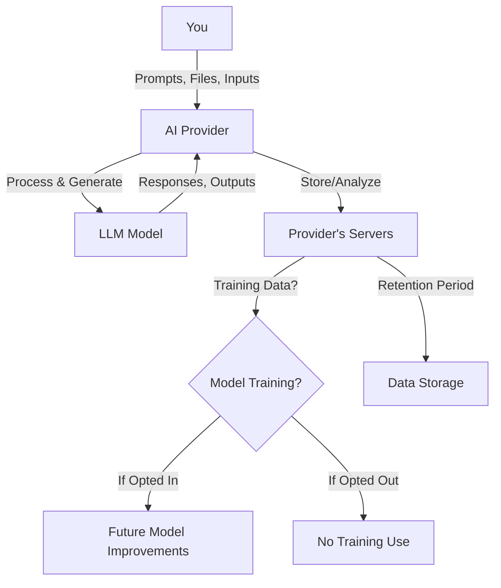

# Privacy Policies of Major LLM Providers (OpenAI, Google, and Anthropic Claude)

## Introduction

Large Language Models (LLMs) like ChatGPT, Google Gemini, and Claude have become part of our daily lives. We use them for work, learning, creativity, and problem-solving. But as we share more information with these AI tools, a critical question arises: **What happens to our data?**

This guide explores the privacy policies of three major LLM providers—OpenAI, Google, and Anthropic. We'll break down what data they collect, how they use it, and what controls you have over your information. Whether you're a student, developer, or business user, understanding these policies helps you make informed decisions about which AI tools to use.

---

## Why Privacy Matters in AI

Privacy in AI is not just about keeping your conversations secret. It's about **control, trust, and safety**. Here's why it matters:

- **Personal Information**: You might share sensitive details—health issues, financial data, or private thoughts—without realizing it.
- **Model Training**: Your conversations could be used to train future AI models, meaning your data might influence responses for other users.
- **Data Retention**: Companies may store your chats for months or years, creating a permanent record of your interactions.
- **Third-Party Access**: Some providers share data with partners or use external services that process your information.
- **Security Risks**: Poorly protected data can be exposed in breaches, putting your information at risk.

For businesses, privacy concerns are even greater. Confidential company data, customer information, or proprietary knowledge shared with an AI tool could be exposed or used inappropriately.

**The bottom line**: When you use an AI tool, you're often sharing more than just questions—you're sharing data that deserves protection.

---

## Overview of the Providers

### OpenAI

**Founded**: 2015  
**Flagship Product**: ChatGPT  
**Mission**: Ensure artificial general intelligence benefits all of humanity

OpenAI offers consumer products (ChatGPT) and enterprise solutions (API, ChatGPT Enterprise). Their privacy approach balances innovation with user control, offering opt-out options for model training and features like temporary chats.

### Google

**Founded**: 1998 (Gemini launched in 2023)  
**Flagship Product**: Google Gemini (formerly Bard)  
**Mission**: Organize the world's information and make it universally accessible and useful

Google integrates AI across its ecosystem (Search, Workspace, Cloud). For consumer users, data may be used for training unless opted out. For enterprise customers, Google offers strong privacy commitments, including no model training without explicit permission.

### Anthropic

**Founded**: 2021  
**Flagship Product**: Claude  
**Mission**: Build reliable, interpretable, and steerable AI systems

Anthropic positions itself as a privacy-conscious alternative. Until recently, they didn't use customer data for training by default. Their current policy uses an **opt-in** model for consumer users, giving explicit control over whether conversations are used for training.

---

## Compare Their Privacy Policies

| Feature                | OpenAI (ChatGPT)                                                                              | Google (Gemini)                                                                                          | Anthropic (Claude)                                                                      |
| ---------------------- | --------------------------------------------------------------------------------------------- | -------------------------------------------------------------------------------------------------------- | --------------------------------------------------------------------------------------- |
| **Data Collection**    | Account info, user content (prompts, files, images), communication info, log data, usage data | Prompts, inputs, usage data, device info, location (consumer); customer data (enterprise)                | Account info, inputs/outputs, payment info, feedback, technical data                    |
| **Data Retention**     | Varies by setting; temporary chats deleted immediately; standard chats retained until deleted | Consumer: retained per Google's policy; Enterprise: configurable, can achieve zero retention             | Consumer: 30 days default, 5 years if opted in; Enterprise: per commercial terms        |
| **Model Training**     | May use content to improve models; **opt-out available**                                      | Consumer: may use anonymized data; **opt-out available**; Enterprise: **NO training without permission** | **Opt-in only** for consumers; Enterprise: **NO training**                              |
| **User Controls**      | Opt out of training, temporary chats, delete history, privacy settings                        | Opt out of training (consumer), data deletion, workspace admin controls                                  | Toggle "Help improve Claude", incognito mode, delete conversations, opt out of training |
| **Chat History**       | Stored by default; can be deleted; temporary chats not stored                                 | Stored by default; can be deleted; enterprise has additional controls                                    | Stored by default; can be deleted; incognito mode not stored                            |
| **API Data Usage**     | Not used for training unless specified in agreement                                           | Not used for training without permission                                                                 | Not used for training (commercial terms)                                                |
| **Enterprise Privacy** | Separate agreements; API data governed by customer contracts                                  | Strong commitments; data stays within organization; no training without permission                       | Commercial terms; data NOT used for training                                            |
| **Security Measures**  | Encryption, privacy safeguards, post-launch monitoring                                        | Encryption in transit and at rest, enterprise-grade security                                             | Standard security measures, encryption                                                  |
| **Compliance**         | GDPR, SOC 2, ISO 27001                                                                        | GDPR, SOC 2, ISO 27001, FedRAMP                                                                          | GDPR, SOC 2, regional supplemental disclosures                                          |

---

## Data Flow in AI Systems

Here's how your data typically moves through an AI system:

---

## OpenAI Privacy Policy

### What Data is Collected?

OpenAI collects several types of personal data:

- **Account Information**: Name, contact details, account credentials, date of birth, payment information
- **User Content**: Your prompts, uploaded files, images, audio, video, and data from connected services
- **Communication Information**: Emails, messages sent through social media or support channels
- **Log Data**: IP address, browser type, date/time of requests, interaction data
- **Usage Data**: How you use the services, features accessed, activity patterns

### Is User Data Used for Model Training?

**Yes, but you can opt out.**

OpenAI states: *"We may use Content you provide us to improve our Services, for example to train the models that power ChatGPT."*

However, users can **opt out** of this training use. OpenAI provides instructions on how to exclude your content from model training. They also offer **temporary chats** where conversations are automatically deleted and not used for training.

### How Can Users Control Their Data?

OpenAI provides several privacy controls:

- **Opt out of model training**: Users can choose not to have their content used for training
- **Temporary chats**: Conversations are automatically deleted and don't inform ChatGPT's memory
- **Delete chat history**: Users can manually delete individual chats or entire history
- **Privacy settings**: Accessible through account settings
- **Data correction/removal requests**: Submit requests via privacy.openai.com or [dsar@openai.com](mailto:dsar@openai.com)

**For API/Enterprise customers**: Data processing is governed by separate customer agreements, not the consumer privacy policy.

---

## Google Gemini Privacy Policy

### Data Collection

Google collects data in several ways when you use Gemini:

- **User inputs**: Your prompts, questions, and any content you submit
- **Usage data**: How you interact with Gemini, features used, session information
- **Device information**: Device type, OS, browser, IP address (with location derived from it)
- **Connected services**: Data from integrated Google services (Drive, Gmail, etc.)

**Important distinction**: Google has different policies for **consumer** vs. **enterprise** users.

### Model Training

- **Consumer users**: Google may use anonymized personal information to train AI models for internal use. Users can **opt out** of this training.
- **Enterprise/Workspace users**: **NO model training without explicit permission**. Google states: *"Your content is not reviewed by humans or otherwise used for Gemini model training outside your domain without permission."*

For Google Workspace, there's a clear commitment: *"No Model Training: Your content is not reviewed by humans or otherwise used for Gemini model training outside your domain without permission."*

### User Controls

- **Opt out of training**: Available for consumer users
- **Data deletion**: Users can delete their conversation history
- **Workspace admin controls**: Administrators can manage data access and permissions
- **DLP policies**: Generated output is evaluated against Data Loss Prevention policies

### Privacy Features

- **Data stays within organization**: For enterprise users, interactions stay within the organization
- **Existing permissions enforced**: AI follows your current Google Workspace permissions
- **Zero data retention**: For Gemini Enterprise Agent Platform, customers can achieve zero data retention with specific configurations
- **Encryption**: Data is encrypted in transit and at rest

---

## Anthropic Claude Privacy Policy

### Data Collection

Anthropic collects the following categories of personal data:

- **Identity and Contact Data**: Name, email, phone number when signing up
- **Payment Information**: If you purchase access to services
- **Inputs and Outputs**: The content you submit (prompts) and the responses generated
- **Feedback**: Ratings and explicit feedback on outputs
- **Study Participation Data**: Responses from research studies or surveys
- **Communication Information**: Messages sent to Anthropic support
- **Verification Data**: Age/identity verification information (ID documents, images, biometric data)
- **Technical Information**: Device info, connection info, IP address, usage data, cookies

### Model Training

**Opt-in system for consumers**:

Anthropic made a significant policy change in 2025. Previously, they **did not use customer data for training** by default. Now, they use an **opt-in model**:

- Users must explicitly choose to allow their data to be used for training
- If you **opt in**, conversations may be retained in de-identified form for up to **5 years** and used for training
- If you **opt out** (the default for new users), data is retained for **30 days** and **not used for training**
- Users can change their preference at any time

**Important exception**: Even if you opt out, conversations flagged for safety, security, or policy violations may be reviewed by human moderators and retained for up to 2 years.

**For enterprise customers**: Data is **NOT used for model training** under commercial terms.

### User Controls

- **"Help improve Claude" toggle**: Control whether conversations are used for training
- **Incognito mode**: Conversations are never used for training, even if the global setting is "on"
- **Delete conversations**: Users can delete individual chats
- **Account deletion**: Deleting your account excludes your data from future training

### Privacy Features

- **Clear opt-in/opt-out**: Explicit control over training data usage
- **Incognito mode**: Guarantees no training use
- **Enterprise protection**: Commercial customers have bulletproof protection against training use
- **Regional disclosures**: Additional privacy information for users in Canada, Brazil, Republic of Korea, and US states with health data laws

---

## Key Differences

### 1. Training Data Approach

- **OpenAI**: Opt-out (training is default, but you can disable it)
- **Google (Consumer)**: Opt-out (training is default, but you can disable it)
- **Google (Enterprise)**: Opt-in (NO training without explicit permission)
- **Anthropic (Consumer)**: Opt-in (NO training unless you explicitly enable it)
- **Anthropic (Enterprise)**: NO training (commercial terms prohibit it)

**Winner for privacy**: Anthropic (consumer) and Google (enterprise) have the strongest positions.

### 2. Data Retention

- **OpenAI**: Not explicitly stated; temporary chats deleted immediately
- **Google**: Consumer data retained per Google's policy; enterprise can achieve zero retention
- **Anthropic**: 30 days (opt-out) or 5 years (opt-in) for consumers; enterprise per commercial terms

**Winner for privacy**: OpenAI's temporary chats and Google's zero retention option for enterprise.

### 3. User Control Granularity

- **OpenAI**: Opt-out, temporary chats, delete history
- **Google**: Opt-out, delete history, admin controls (enterprise)
- **Anthropic**: Opt-in toggle, incognito mode, delete conversations

**Winner for privacy**: Anthropic offers the most granular control with both a global toggle and incognito mode.

### 4. Enterprise Privacy Commitments

All three providers offer strong enterprise privacy protections:

- **No model training** without explicit permission (Google, Anthropic) or per agreement (OpenAI)
- **Data stays within organization** (Google)
- **Separate commercial terms** that supersede consumer policies

**All are strong**, but Google and Anthropic make the clearest "no training" commitments.

### 5. Transparency

- **Anthropic** has been most transparent about policy changes, giving users clear deadlines and choices
- **OpenAI** provides clear opt-out instructions and temporary chat options
- **Google** has comprehensive documentation but can be complex to navigate

**Winner for privacy**: Anthropic for clear communication about changes.

---

## Best Practices for Protecting Your Privacy While Using AI Tools

### For Individual Users

1. **Understand the defaults**: Know whether your data is used for training by default
2. **Use opt-out/toggle settings**: If privacy is important, disable model training use
3. **Use temporary/incognito modes**: For sensitive conversations, use modes that don't store data
4. **Don't share sensitive information**: Avoid entering personal, financial, or health data
5. **Delete conversations regularly**: Clear your chat history periodically
6. **Review connected services**: Check what third-party apps have access to your AI tool
7. **Use strong passwords**: Protect your AI account with a strong, unique password
8. **Enable 2FA**: Add two-factor authentication for extra security

### For Business/Enterprise Users

1. **Choose enterprise plans**: Use business/enterprise versions with stronger privacy commitments
2. **Review data processing agreements**: Understand how your data is handled
3. **Configure retention policies**: Set appropriate data retention periods
4. **Train employees**: Educate staff on what can/cannot be shared with AI tools
5. **Use access controls**: Limit who can use AI tools and what data they can access
6. **Monitor usage**: Track how AI tools are being used in your organization
7. **Implement DLP policies**: Use Data Loss Prevention to prevent sensitive data sharing
8. **Regular audits**: Periodically review AI tool usage and data handling

### For Developers Using APIs

1. **Read the API terms carefully**: Understand data handling for API usage
2. **Don't send sensitive data**: Avoid transmitting personal or confidential information
3. **Use data minimization**: Only send the minimum data needed
4. **Implement caching**: Store responses locally to avoid re-sending prompts
5. **Review vendor agreements**: Understand your provider's data processing terms

---

## Which Provider Is Better for Privacy?

The answer depends on your use case:

### For Maximum Privacy (Consumer)

**Anthropic Claude** currently offers the strongest privacy protections for individual users:

- **Opt-in training** (not opt-out)
- **30-day retention** if you don't opt in
- **Incognito mode** for guaranteed no-training conversations
- **Clear controls** and transparency

### For Enterprise Users

**Google Gemini** and **Anthropic Claude** both offer excellent enterprise privacy:

- **Google**: No training without permission, data stays within organization, zero retention possible
- **Anthropic**: No training for commercial customers, strong privacy commitments

**OpenAI** also provides enterprise privacy protections through separate agreements.

### For Temporary/One-Time Use

**OpenAI's temporary chats** are ideal for sensitive conversations you don't want stored.

### For Transparency

**Anthropic** has been most transparent about policy changes and gives users clear choices.

### Balanced Conclusion

| Use Case                | Best Choice   | Runner-Up             |
| ----------------------- | ------------- | --------------------- |
| Individual privacy      | **Anthropic** | OpenAI                |
| Enterprise privacy      | **Google**    | Anthropic             |
| Temporary conversations | **OpenAI**    | Anthropic (incognito) |
| Transparency            | **Anthropic** | OpenAI                |
| Opt-out simplicity      | **OpenAI**    | Google                |

**Important Note**: Privacy policies can change. Always check the latest official policies from each provider before making decisions based on privacy concerns.

---

## Key Takeaways

- **All three providers collect your prompts and interactions** as part of providing their services.
- **Model training is the biggest privacy concern**: Your conversations might be used to improve future AI models.
- **Anthropic has the most privacy-friendly default**: Opt-in training means your data isn't used unless you explicitly allow it.
- **Google offers the strongest enterprise protections**: Clear "no training without permission" commitment for business users.
- **OpenAI provides good controls**: Opt-out available, temporary chats, and clear privacy settings.
- **Enterprise plans are more private**: All three offer stronger privacy commitments for business customers.
- **You have control**: Use opt-out settings, temporary/incognito modes, and delete conversations to protect your privacy.
- **Never assume privacy**: Even with strong policies, avoid sharing truly sensitive information with any AI tool.
- **Policies change**: Stay informed about updates to privacy policies from your AI providers.

---

## References

### Official Privacy Policies

- [OpenAI Privacy Policy](https://openai.com/policies/row-privacy-policy/)
- [OpenAI US Privacy Policy](https://openai.com/policies/us-privacy-policy/)
- [OpenAI Consumer Privacy Settings](https://openai.com/consumer-privacy/)
- [Google Cloud Data Governance for Gemini](https://docs.cloud.google.com/gemini/docs/discover/data-governance)
- [Google Workspace Generative AI Privacy Hub](https://knowledge.workspace.google.com/admin/generative-ai/generative-ai-in-google-workspace-privacy-hub)
- [Google Cloud Privacy Notice](https://cloud.google.com/privacy)
- [Anthropic Privacy Policy](https://www.anthropic.com/legal/privacy)
- [Anthropic Non-User Privacy Policy](https://www.anthropic.com/legal/non-user-privacy)
- [Anthropic Consumer Terms Updates](https://www.anthropic.com/news/updates-to-our-consumer-terms)

### Additional Resources

- [Google AI/ML Privacy Commitment](https://cloud.google.com/ai/ml-privacy-commitment)
- [Gemini Enterprise Agent Platform - Zero Data Retention](https://docs.cloud.google.com/gemini-enterprise-agent-platform/resources/zero-data-retention)
- [Anthropic Help Center - Model Training](https://help.anthropic.com)

*Last updated: August 2026. Privacy policies may have changed since this document was written. Always refer to the official sources for the most current information.*